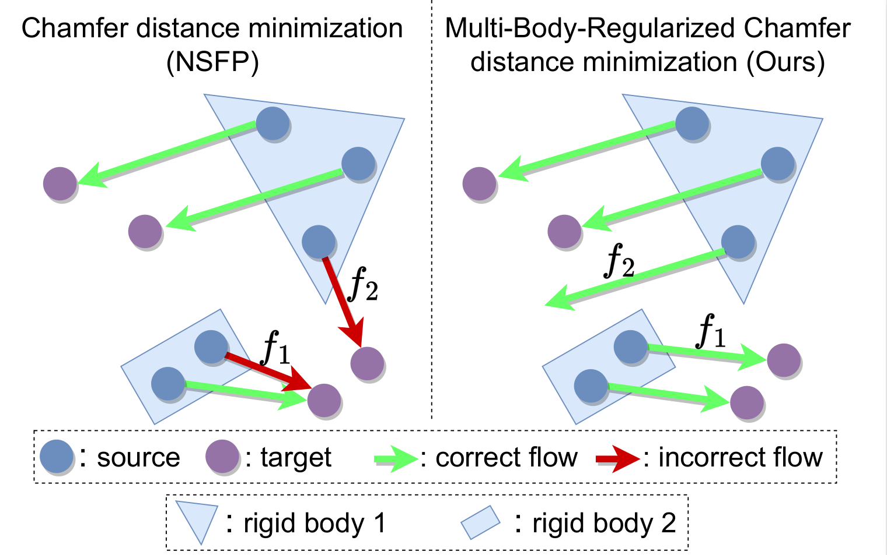
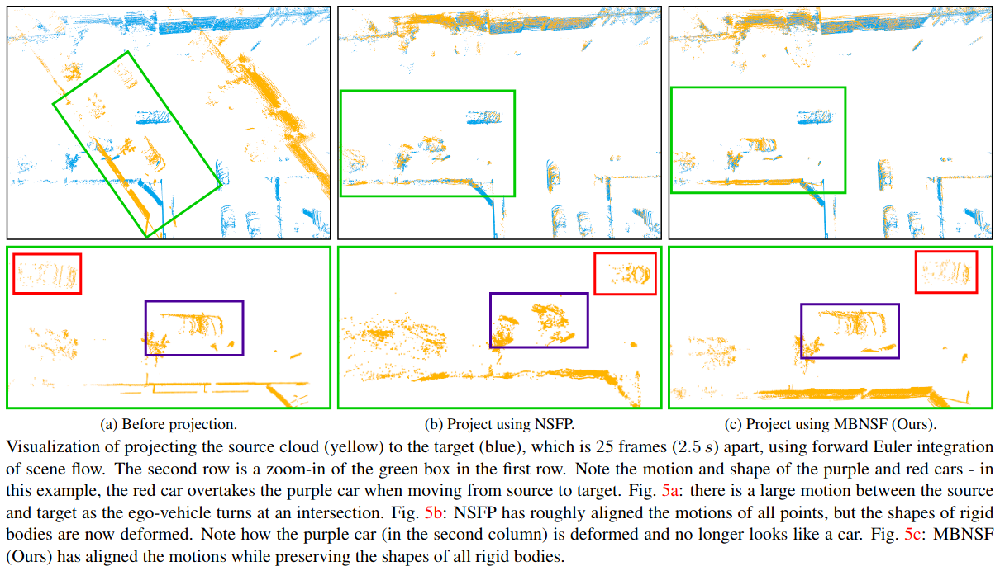

# MBNSF

This repository is the official open-source implementation of the paper *MBNSF* - 3DV'2024 (oral): 

> <b>Multi-Body Neural Scene Flow</b> <br>
> [Kavisha Vidanapathirana](https://kavisha725.github.io/), [Shin-Fang Ch'ng](https://scholar.google.com/citations?user=0O8DYvQAAAAJ&hl=en), [Xueqian Li](https://lilac-lee.github.io/), [Simon Lucey](https://scholar.google.com.au/citations?user=vmAe35UAAAAJ&hl=en)<br>
> International Conference on 3D Vision 2024 [arXiv](https://arxiv.org/abs/2310.10301)

This repository contains the code for:
- Evaluation of 3D scene flow and 4D trajectory estimation (via forward-Euler integration) on the Argoverse dataset using [MBNSF (Ours)](https://github.com/kavisha725/MBNSF/blob/main/scene_flow_estimation/mbnsf.py) and [NSFP - NeurIPS'2021](https://github.com/Lilac-Lee/Neural_Scene_Flow_Prior) (Tab. 1 and 2 in the paper).
- Our implementation of [NSFP++ - ECCV'2022](https://www.ecva.net/papers/eccv_2022/papers_ECCV/papers/136980416.pdf) (Tab. 4 in the paper).
- Our implementation of [NTP - CVPR'2022](https://openaccess.thecvf.com/content/CVPR2022/papers/Wang_Neural_Prior_for_Trajectory_Estimation_CVPR_2022_paper.pdf) and [MBNT (ours)](https://github.com/kavisha725/MBNSF/blob/main/trajectory_estimation/mbnt.py) for direct 4D trajectory prediction (Tab. 2 in the paper).


## Method overview
*MBNSF* is a regularizor for incorporating multi-body rigidity into neural scene flow in a manner that (1) doesn't require explicit estimaiton of SE(3) parameters for each rigid body, (2) is robust to the inherent noise in real-world LiDAR datasets, (3) maintains the fully unsupervised nature, and (4) maintains the estimation of continuous flow fields.





<br />

## Prerequisites

### Environment dependencies

<details>
  <summary><b>Set up base environment</b></summary><br/>
  
  - Create [conda](https://docs.conda.io/en/latest/) environment with python:
  ```bash
  conda create --name mbnsf python=3.9.4
  conda activate mbnsf
  ```
  - Install PyTorch with suitable cudatoolkit version. See [here](https://pytorch.org/):
  ```bash
  conda install pytorch==1.12.1 torchvision==0.13.1 torchaudio==0.12.1 -c pytorch
  # Make sure the pytorch cuda version matches your output of 'nvcc --version'
  ```
  - Install [Pytorch3D](https://github.com/facebookresearch/pytorch3d/blob/main/INSTALL.md):
  ```bash
  conda install -c fvcore -c iopath -c conda-forge fvcore iopath
  conda install -c bottler nvidiacub
  conda install pytorch3d -c pytorch3d
  ```
  - Install [Open3D](https://github.com/isl-org/Open3D):
  ```bash
  pip install open3d
  ```
  - Test installation using:
  ```bash
  python -c "import torch ; import pytorch3d ; import open3d ; print(torch.cuda.is_available())"
  ```

</details>

<br />

### Datasets
This repository provides evaluation scripts for the Argoverse dataset.

<details>
  <summary><b>Download Argoverse test set:</b></summary><br/>

  Our test set for Argoverse consists of 18 sequences with 25 consecutive frames for evaluating long-term trajectories (which also results in 450 pairs for scene flow evaluation)

  - Download the Argoverse test set from [here](https://drive.google.com/file/d/1YFpopuyqe52qo85U8HMmJ9cTR3WHkJFT/view?usp=sharing) (~1.5 GB).
  - (Optional) The code for preparing this test set is provided in ```utils/get_gt_traj_argoverse.py```.

</details>

<details>
  <summary><b> For the Waymo test set:</b></summary><br/>

  For Waymo, we use the same test set as provided in [FNSF](https://github.com/Lilac-Lee/FastNSF). 

  - Download the Waymo test set from [here](https://github.com/Lilac-Lee/FastNSF).
  - (Optional) Instructions for preparing this test set are provided [here](https://github.com/Lilac-Lee/FastNSF/blob/main/utils/WAYMO_OPEN_README.md).

</details>

<br />

## Evaluation

This section re-creates the results of Tab. 1 and Tab. 2 in our paper on the Argoverse dataset.


<details>
  <summary><b>3D Scene Flow Prediction</b></summary><br/>

  In this section we optimize a scene flow field for a given pair of point clouds. 
  ```
  cd scene_flow_estimation/
  ```
  - Scene flow optimization using [NSFP](https://github.com/Lilac-Lee/Neural_Scene_Flow_Prior) (baseline):
  ```
  python nsfp.py --dataset_path </path/to/data>
  ```
  - Scene flow optimization using MBNSF (ours):
  ```
  python mbnsf.py --dataset_path </path/to/data>
  ```

</details>

<details>
  <summary><b>4D Trajectory Prediction</b></summary><br/>

  In this section we optmize a trajectory field for a sequence of point clouds.
  ```
  cd trajectory_estimation/
  ```
  - Long-Tem trajectory optimization using [NSFP](https://github.com/Lilac-Lee/Neural_Scene_Flow_Prior) (baseline) + Forward Euler integration:
  ```
  python nsfp_fe.py --exp_name nsfp_fe_test --dataset_path </path/to/data>
  python compute_traj_metrics.py --exp_name nsfp_fe_test --dataset_path </path/to/data>
  ```
  - Long-Tem trajectory optimization using MBNSF (ours) + Forward Euler integration:
  ```
  python mbnsf_fe.py --exp_name mbnsf_fe_test --dataset_path </path/to/data>
  python compute_traj_metrics.py --exp_name mbnsf_fe_test --dataset_path </path/to/data>
  ```
  - Long-Tem trajectory optimization using [NTP](https://openaccess.thecvf.com/content/CVPR2022/papers/Wang_Neural_Prior_for_Trajectory_Estimation_CVPR_2022_paper.pdf) (baseline, our implementation):
  ```
  python ntp.py --exp_name ntp_test --dataset_path </path/to/data>
  python compute_traj_metrics.py --exp_name ntp_test --dataset_path </path/to/data>
  ```
  - Long-Tem trajectory optimization using MBNT (ours): NTP + our regularizor:
  ```
  python mbnt.py --exp_name mbnt_test --dataset_path </path/to/data>
  python compute_traj_metrics.py --exp_name mbnt_test --dataset_path </path/to/data>
  ```


</details>

<br />



<br />

## Citation

If you find this work useful in your research, please cite:

```
@inproceedings{vidanapathirana2023mbnsf,
  title={Multi-Body Neural Scene Flow},
  author={Vidanapathirana, Kavisha and Chng, Shin-Fang and Li, Xueqian and Lucey, Simon},
  booktitle={2024 International Conference on 3D Vision (3DV)},
  year={2024},
  organization={IEEE}
}
```


## Acknowledgement
Functions from 3rd party have been acknowledged at the respective function definitions or readme files. 

This project was mainly inspired by [NSFP](https://github.com/Lilac-Lee/Neural_Scene_Flow_Prior) and [SpectralMatching](https://ieeexplore.ieee.org/document/1544893).

